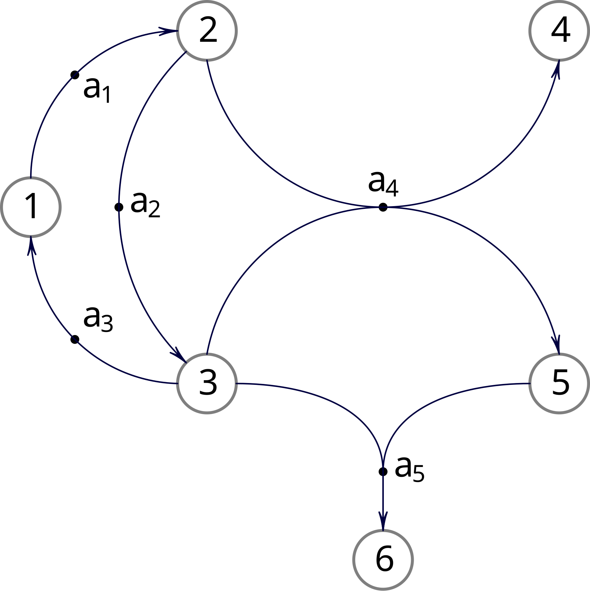
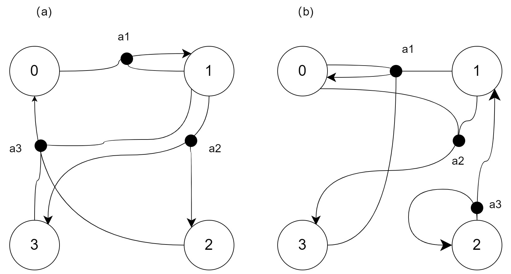
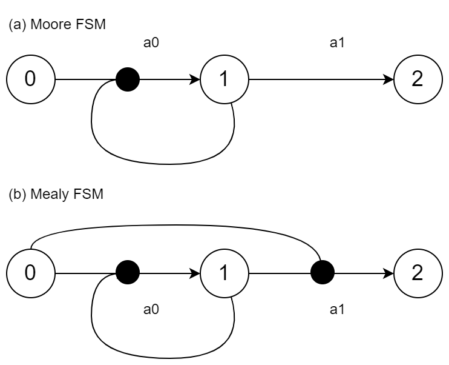
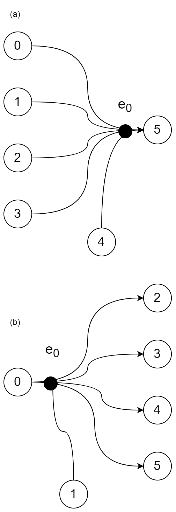
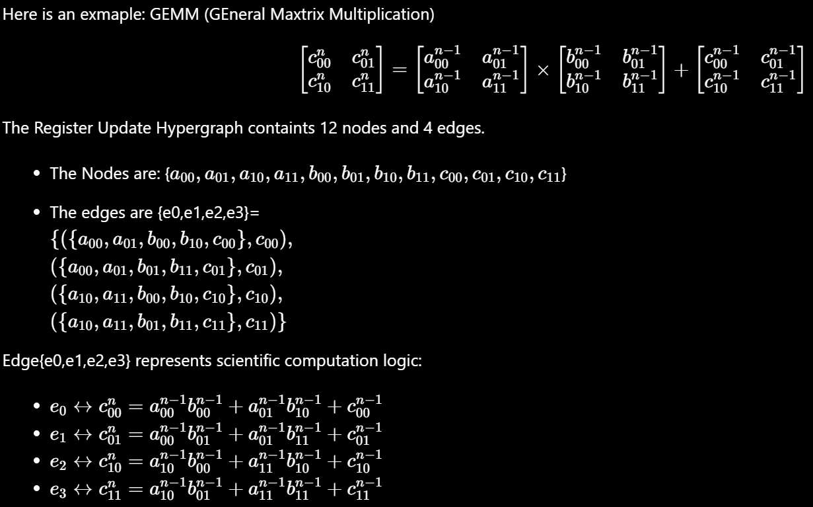

# MachinePy Hypergraph Convention
When using @MachinePy for HDL coding, the MachienPy Hypergraph convention should be followed. 

The main content of the MachienPy Hypergraph convention is to standardize code writing with reference to a directed hypergraph, so that the final code can present the structure of a directed graph. The advantage of this is that it can make HDL easy to maintain, highly readable, and highly abstract. The final digital circuit structure is basically consistent with the directed hypergraph structure presented in the code.

## Design Abstraction Level

In digital circuit design, for different levels of abstraction, there are several commonly used components and units. Some of the most used components and units include:
- Registers: Registers are storage elements that hold data temporarily. They are used to store intermediate results, control signals, and data in digital circuits.
- Adders: Adders are used to perform arithmetic addition operations in digital circuits. They are essential for tasks like incrementing counters, adding operands, and performing arithmetic operations. 
  - Arithmetic Logic Units (ALU): ALUs are combinational circuits that perform arithmetic and logic operations on input data. They are crucial for tasks like addition, subtraction, AND, OR, and other bitwise operations.
- Multiplexers (Mux): Multiplexers are used to select one of many input signals and route it to the output based on control signals. They are commonly used for data selection and routing in digital circuits.
  - Demultiplexers (De-Mux): Demultiplexers are used to take a single input signal and route it to one of many possible output lines based on control signals. They are the inverse of multiplexers and are used for data distribution.
- Finite State Machines (FSM): Finite State Machines are used to model the behavior of digital systems with a finite number of states. They are essential for controlling the sequence of operations in digital circuits.

- Control Units: Control units are responsible for generating control signals that coordinate the operation of various components in a digital circuit. They manage the sequencing and timing of operations.
- Memory Units: Memory units are used to store data and program instructions in digital systems. They can be implemented as registers, RAM (Random Access Memory), ROM (Read-Only Memory), or other types of memory.

These components and units form the building blocks of RTL designs and are essential for implementing complex digital systems efficiently.

## Hypergraph Abstraction
Hypergraph abstraction follows the RTL(Register Transfer Level) abtraction. Any abstraction level that is higher than RTL will build on hypergraph abstraction.

### Register Transfer
Hypergraph abstraction follows the RTL(Register Transfer Level) abtraction. Only directed hypergraphs are used in the MachinePy convention. 

In mathematics, a hypergraph is a generalization of a graph in which an edge can join any number of vertices. Formally, a directed hypergraph is a pair (𝑋,𝐸), where 𝑋 is a set of elements called nodes,vertices, points, or elements and 𝐸 is a set of pairs of subsets of 𝑋. Each of these pairs (𝐷,𝐶)∈𝐸 is called an edge or hyperedge; the vertex subset 𝐷 is known as its tail or domain, and 𝐶 as its head or codomain. For example:


*An exmaple of a directed hypergraph, with X={1,2,3,4,5,6} and E={a1,a2,a3,a4,a5}={({1},{2}),({2},{3}),({3},{1}),({2,3},{4,5}),({3,5},{6})}*

MachinePy Hypergraph conventions that 
- Register Update Hypergraph: using a directed hyergraph with nodes being registers (conetent) and edges being register transter update function/logics. 
- Register Moment Hypergraph: using a directed hypergraph with nodes being registers update validation (the update enable, or whether/when the registers should be updated) signal and edges being function/logics that calculate  whether/when the registers should be updated. In other words, edges represent the function/logic that will calculate the proper moment to update the registers.


Here is a more specific example:

*A 4-node hypergraph example. (a)Register Update Hypergraph.(b)Register Moment Hypergraph. Although both (a) and (b) contain 3 edges, the represented meanings are different.In (a), Edge a1,a2,a3 means the register content update process. In (b), Edge a1,a2, and a3 represent the process of calculating the exact monment to update the corresponding registers.*

In order to further demostrate the hypergraph convention, Verilog code about the above exmaple is shown here:

```verilog
module exmpale_4_node(
    input wire         clk      ,
    input wire         rst      ,
    input wire [8-1:0] node_in  ,
    output wire[8-1:0] node_out
);
// =========================
// ==== function ===========
// =========================
function [8-1:0] f_node_0_update(input [7:0] x0, input [7:0] x1, input [7:0] x2);
    f_node_0_update = x0+x1+x2;
endfunction

function [8-1:0] f_node_1_update(input [7:0] x0, input [7:0] x1);
    f_node_1_update = x0+x1;
endfunction

function [16-1:0] f_node_2_3_update(input [7:0] x0);
    f_node_2_3_update = {x0 , x0};
endfunction

function [1-1:0] f_node_0_moment(input [7:0] x0, input [7:0] x1);
    f_node_0_moment = x0 > x1;
endfunction

function [2-1:0] f_node_1_2_moment(input [7:0] x0);
    f_node_1_2_moment = {{x0[3]==1'b0}, {x0[4]==1'b0}};
endfunction

function [1-1:0] f_node_3_moment(input [7:0] x0 , input [7:0] x1);
    f_node_3_moment = x0 < x1;
endfunction


reg  [8-1:0]node_0        ;
reg  [8-1:0]node_1        ;
reg  [8-1:0]node_2        ;
reg  [8-1:0]node_3        ;
 
wire [8-1:0]node_0_update ;
wire [8-1:0]node_1_update ;
wire [8-1:0]node_2_update ;
wire [8-1:0]node_3_update ;
 
wire node_0_moment        ;
wire node_1_moment        ;
wire node_2_moment        ;
wire node_3_moment        ;

always @(posedge clk)begin
    if(rst)begin
        node_0 <=8'b0;
        node_1 <=8'b0;
        node_2 <=8'b0;
        node_3 <=8'b0;
    end else begin
        if(node_0_moment)begin
            node_0 <= node_0_update;
        end
        if(node_1_moment)begin
            node_1 <= node_1_update;
        end
        if(node_2_moment)begin
            node_2 <= node_2_update;
        end
        if(node_3_moment)begin
            node_3 <= node_3_update;
        end
    end
end

// register update
assign node_0_update   = f_node_0_update(node_1 & node_in, node_2, node_3);
assign node_1_update   = f_node_1_update(node_0, node_1);
wire [16-1:0]node_2_3_update;
assign node_2_3_update = f_node_2_3_update(node_1);
assign node_2_upadte = node_2_3_update [ 8-1:0];
assign node_3_upadte = node_2_3_update [16-1:8];
// register moment
assign node_0_moment = f_node_0_moment(node_0, node_1);
wire [2-1:0] node_1_2_moment ;
assign node_1_2_moment = f_node_1_2_moment(node_2);
assign node_1_moment = node_1_2_moment[0];
assign node_2_moment = node_1_2_moment[1];
assign node_3_moment = f_node_3_moment(node_0, node_1);
// connect input/output
assign node_out = node_0;

endmodule
```


### Finite State Machine

A Finite State Machine (FSM) is a mathematical model used in digital system design to represent and control the behavior of sequential logic circuits. In RTL (Register Transfer Level) design, FSMs are commonly used to describe the control logic of digital systems. Here are some key points about Finite State Machines in RTL design:
- State: An FSM consists of a set of states, each representing a specific condition or mode of operation of the system. In RTL design, states are typically represented using state variables or state registers.
- Transitions: Transitions define the movement of the FSM from one state to another based on input conditions. Transitions are triggered by input signals and can be conditional or unconditional.
- Inputs and Outputs: FSMs have input signals that influence state transitions and output signals that depend on the current state. Inputs are used to determine the next state, while outputs reflect the current state or control external signals.
- State Diagram: A graphical representation of an FSM showing states, transitions, and conditions is called a state diagram. State diagrams help visualize the behavior of the FSM and aid in designing the control logic.
- Types of FSM:
  - Moore Machine: In a Moore machine, outputs depend only on the current state of the machine. Output values are associated with each state.
  - Mealy Machine: In a Mealy machine, outputs depend on both the current state and the inputs. Output values are associated with state transitions.
- Design Process:
  - State Encoding: Assigning binary codes to states for implementation.
State Transition Logic: Determining the conditions for state transitions based on inputs.
  - Output Logic: Defining the output values associated with states or transitions.
  - RTL Implementation: Writing RTL code (Verilog/VHDL) to implement the FSM based on the design specifications.
- Applications:
FSMs are used in control units of processors, communication protocols, digital signal processing, and various other digital systems.
They help in designing sequential circuits with complex control logic in a structured and systematic manner.

Finite State Machines play a crucial role in RTL design by providing a structured way to model and implement sequential logic circuits. They help in designing efficient and reliable digital systems by defining the control behavior based on states and transitions.

FSM can be abstracted very conveniently according to the MachinePy Hypergraph Convention. The example is shown here:

<br>
*(a)Moore and (b)Mealy Finite State Machine Register Update Hypergraph (Register Moment Hypergraph are not indicated). Node 1 represents the current state of the FSM. Node 0 is the input node(register), and Node 2 is the output node(register). Edge a0 is State Transition Logic and Edge a1 is the Output Logic. It clearly shows that Mealy FSM differs from Moore FSM only on the edge connecting Node 0 and Node 2. Mealy FSM updates Node 2 based on both Node 0 and Node 1, while Moore FSM updates Node 2 only based on Node 1.*

### Data Flow

Data Flow mainly refers to the Mux and Demux Hypergraph abstraction:
<br>
*Mux(a) and Demux(b)* could be abstracted as hypergraph. In (a), the Mux uses Node 4 to select the data from Node 0,1,2,3 to finally go to Node 5. In(b), the Demux uses Node 1 to choose the destination of Node 0 to go to Node 2,3,4, or 5.

### Scientific Computation Pipeline

Designing a scientific computation pipeline in RTL (Register Transfer Level) involves breaking down the computation into stages that can be executed sequentially. Each stage performs a specific operation on the data and passes the intermediate results to the next stage. Here's a general outline of how you can design a scientific computation pipeline in RTL:

Steps to Design a Scientific Computation Pipeline in RTL:
- Identify Computation Stages: Break down the scientific computation into distinct stages or operations. Each stage should perform a specific computation on the input data.

- Define Data Flow: Determine the flow of data between the stages. Identify the inputs and outputs of each stage. Ensure that the output of one stage serves as the input to the next stage.

- RTL Module Design: Create RTL modules for each computation stage. Define the inputs, outputs, and internal registers for each module. Implement the logic for the computation within each module.

- Pipeline Registers: Introduce pipeline registers between the stages to store intermediate results.Pipeline registers help in synchronizing the data flow between stages and enable pipelining.

- Control Logic: Implement control logic to manage the flow of data through the pipeline. Control signals determine when to start and stop each stage and when to transfer data between stages.



